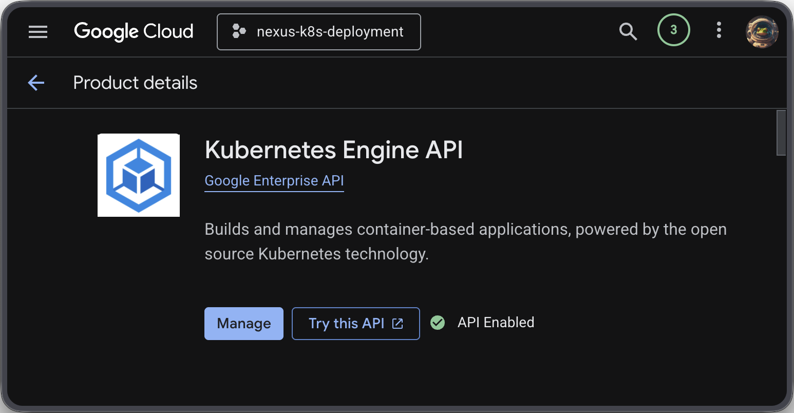
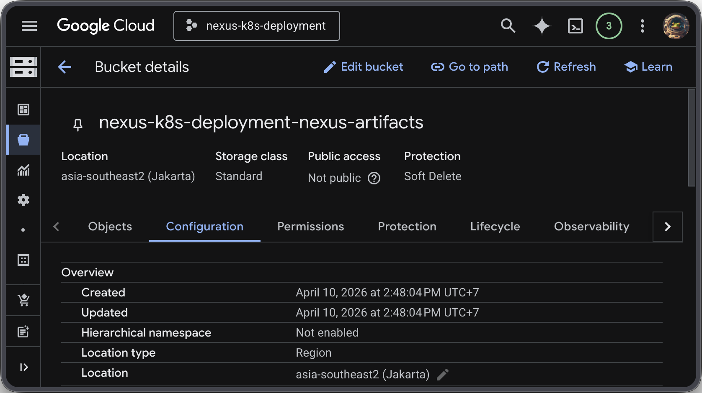
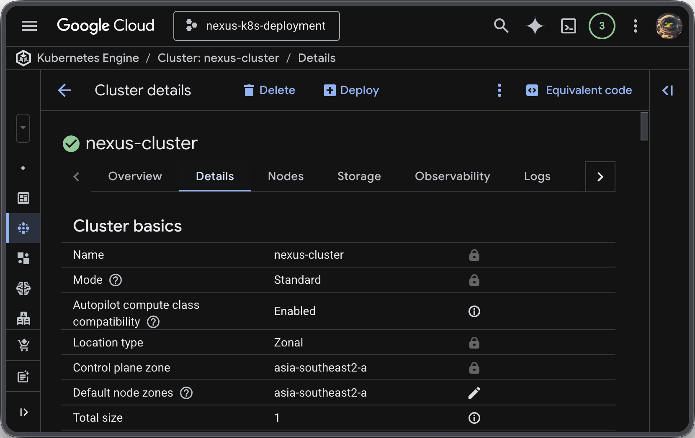
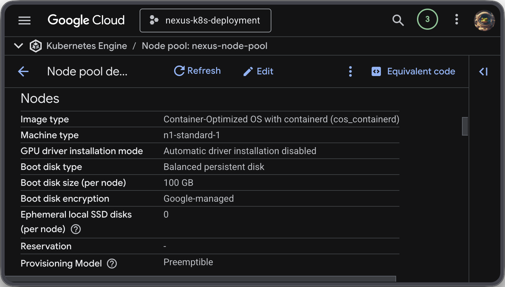
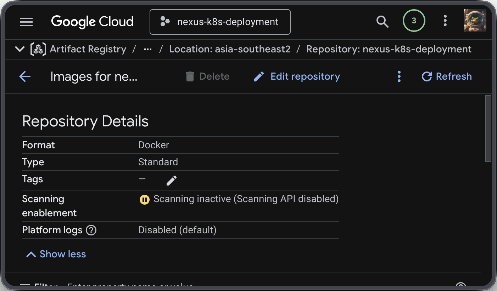
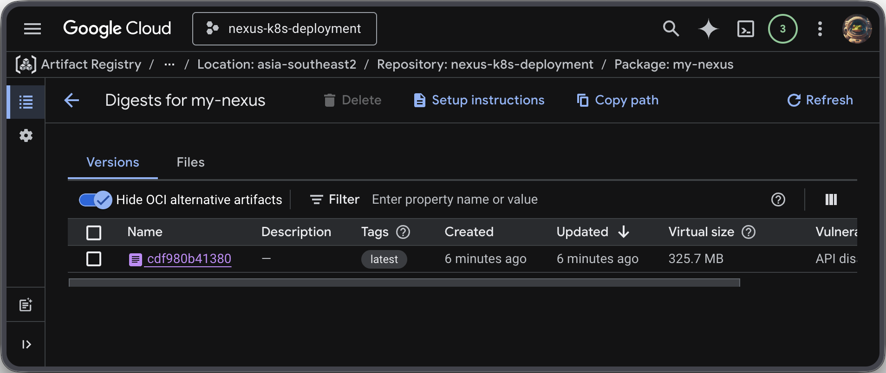
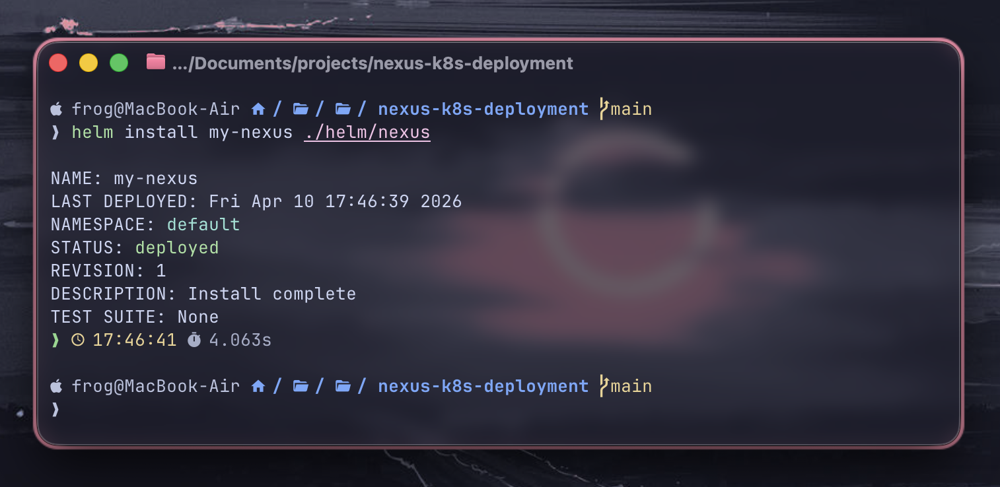
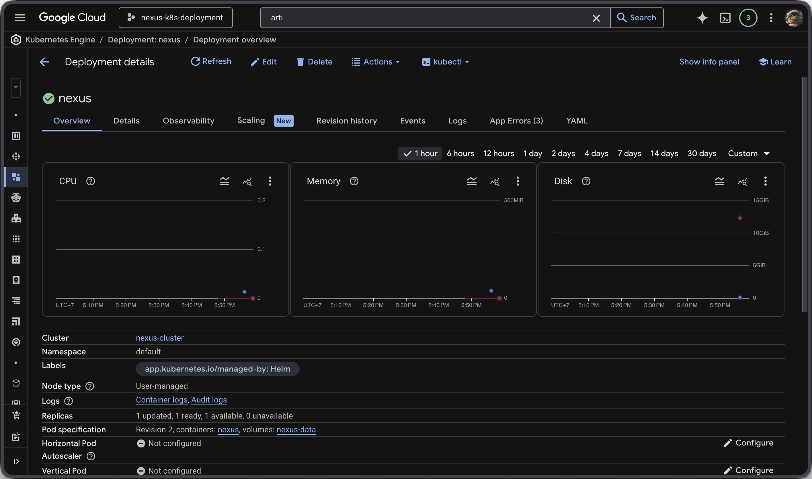
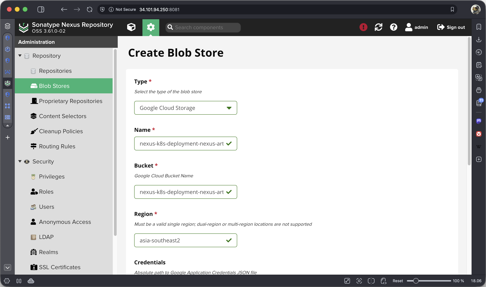

# Nexus 3 on GKE with GCS Blobstore

## Prerequisites:

- GCP project
    - Kubernetes Engine API
- gcloud
- terraform
- docker
- helm




## 1. Terraform

```bash
# Change to terraform directory
cd terraform

# Initialize terraform
terraform init

export PROJECT_ID="<project-id>"

# Apply terraform
terraform apply -var='project_id=$PROJECT_ID'
```

### GCS Bucket



### GKE Cluster



### GKE Node Pool



### Artifact Registry



## 2. Build and push image to registry

```bash
# Configure docker to use GCP Artifact Registry
gcloud auth configure-docker \
    asia-southeast2-docker.pkg.dev

# Back to root directory
cd ..

# Build custom nexus image
docker build -t asia-southeast2-docker.pkg.dev/$PROJECT_ID/$PROJECT_ID/my-nexus:latest .

# Push image to registry
docker push asia-southeast2-docker.pkg.dev/$PROJECT_ID/$PROJECT_ID/my-nexus:latest
```



## 3. Deploy Nexus 3 to GKE

```bash
# Get credentials to access GKE cluster
gcloud container clusters get-credentials nexus-cluster --zone asia-southeast2-a --project $PROJECT_ID

# Deploy nexus with helm
helm install my-nexus ./helm/nexus

# Get admin password
kubectl exec deployment/nexus -- cat /nexus-data/admin.password
```

### Deploy nexus with helm



### Check nexus deployment



### Nexus GCS Blobstore



## Continuous integration - a theoretical question

```
We might have to modify the previously created files, for example because of a new Nexus version.

We want this to automatically be deployed to a test environment after we have made the changes on Git.

Please describe in a few words how you would satisfy this need.
```

I would set up a CI/CD pipeline for example using GitHub Actions, where I develop changes in a test branch.

The pipeline would:

1. Trigger on push to the test branch
2. Validate Terraform and manifest files
3. Automatically deploy to a test environment

This ensures that every change in test branch is automatically deployed to a test environment.